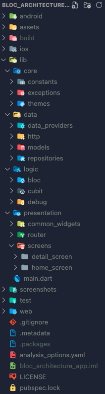
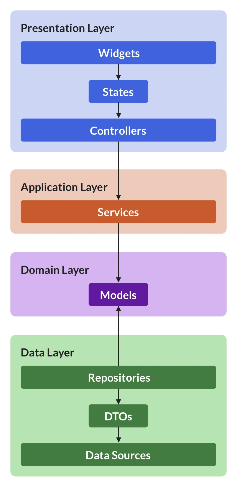
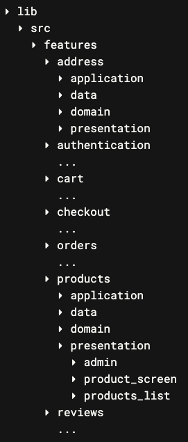

&nbsp;&nbsp;
&nbsp;&nbsp;
<a href="https://choosealicense.com/licenses/mit/" target="_blank"></a>&nbsp;&nbsp;
&nbsp;&nbsp;


# Scalable App Architecture

</img>

This scalable app architecture design is inspired by [Andrea Bizzotto](https://github.com/bizz84). Full documentation of this design can be found [here](https://codewithandrea.com/articles/flutter-project-structure/). In addition to that, you can use a VSCode extension called [Flutter Feature Scaffolding](https://marketplace.visualstudio.com/items?itemName=KiritchoukC.flutter-clean-architecture) for easily generating the features' folders. This design is using BLoC state-management solution, and for more information on BLoC library, I would strongly suggest you to follow their official [documentation](https://bloclibrary.dev).

This project contains everything that you will need in order to immediately start developing your highly scaled application. You can also call this folder structure as <b> Feature-first (layers inside features) </b> design.

<b><h2> About the folder structure </h2></b>

</img>

```
    lib/
    ├── src/
    │   ├── common_widgets/
    │   │   └── common_button.dart
    │   ├── constants/
    │   │   └── colors.dart
    │   ├── exceptions/
    │   │   └── routing_exception.dart
    │   ├── features/
    │   │   ├── address/
    │   │   │   ├── data/
    │   │   │   │   ├── datasources/
    │   │   │   │   │   └── address_datasources.dart
    │   │   │   │   ├── models/
    │   │   │   │   │   └── address_model.dart
    │   │   │   │   └── repositories/
    │   │   │   │       └── address_repositories.dart
    │   │   │   ├── domain/
    │   │   │   │   ├── entities/
    │   │   │   │   │   └── address_entities.dart
    │   │   │   │   ├── repositories/
    │   │   │   │   │   └── address_repositories.dart
    │   │   │   │   └── usecases/
    │   │   │   │       └── address_usecases.dart
    │   │   │   └── presentation/
    │   │   │       ├── bloc/
    │   │   │       │   ├── address_bloc.dart
    │   │   │       │   ├── address_event.dart
    │   │   │       │   └── address_state.dart
    │   │   │       ├── pages/
    │   │   │       │   └── address_page.dart
    │   │   │       └── widgets/
    │   │   │           └── address_widgets.dart
    │   │   ├── authentication/
    │   │   │   └── (...)
    │   │   ├── cart/
    │   │   │   └── (...)
    │   │   ├── checkout/
    │   │   │   └── (...)
    │   │   ├── orders/
    │   │   │   └── (...)
    │   │   └── products/
    │   │       └── (...)
    │   ├── localization/
    │   │   ├── app_bn.arb
    │   │   ├── app_en.arb
    │   │   └── localization.dart
    │   ├── routing/
    │   │   └── routing.dart
    │   └── utils/
    │       └── utils.dart
    └── main.dart
```

You might notice that some files are just dummy (like api.dart, model.dart).
They are placed there just for git to take the folder structure into consideration.
Leaving those folders empty won't let git to take them into consideration. Since this is mostly a startup project, I was thinking of offering you the standard folder structure from the start. Of course, this may change multiple times, improving every time more and more.

## Why this design pattern?

</img>

This architecture is made of four distinct layers, each containing the components that our app needs: <br>

```
➮ presentation: widgets, states, and controllers
➮ application: services
➮ domain: models
➮ data: repositories, data sources,
        and DTOs (data transfer objects)
```

Of course, if we're building just a single-page app, we can put all files in one folder and call it a day. 😎

But as soon as we start adding more pages and have various data models to deal with, how can we organize all our files in a consistent way?

In practice, a <b> feature-first </b> or <b> layer-first </b> approach is often used.

<b><h2> Layer-first: Drawbacks </h2></b>

This approach is easy to use in practice, but <b> doesn't scale very well </b> as the app grows.

For any given feature, files that belong to different layers are far away from each other. And this makes it harder to work on individual features because we have to keep jumping to different parts of the project.

And if we decide that we want to delete a feature, it's far too easy to forget certain files, because they are all organized by layer.

For these reasons, the <b> feature-first </b> approach is often a better choice when building medium/large apps.

<b><h2> What about shared code? </h2></b>

Of course, when building real apps you'll find that your code doesn't always fit neatly into specific folders as you intended.

What if two or more separate features need to share some widgets or model classes?

In these cases, it's easy to end up with folders called `shared` or `common`, or `utils`.

But how should these folders themselves be organized? And how do you prevent them from becoming a dumping ground for all sorts of files?

If your app has 20 features and has some code that needs to be shared by only two of them, should it really belong to a top-level `shared` folder?

What if it's shared among 5 features? Or 10?

In this scenario, there is no right or wrong answer, and you have to use your best judgement on a case-by-case basis.

## What is a `feature`?

</img>

`Feature-first is not about the UI!`

Feature is not about what the user <b>sees</b>, but what the user <b>does</b>:

```
   ➮ authenticate
   ➮ manage the shopping cart
   ➮ checkout
   ➮ view all past orders
   ➮ leave a review
```

In other words, a feature is a <b>functional requirement</b> that helps the user <b>complete a given task</b>.

And using some hints from <b>domain-driven design</b>, I decided to organize the project structure around the domain layer.

Once I figured that out, everything fell into place. And I ended up with seven functional areas that you can see on the right.

Note that with this approach is still possible for code inside a given feature to depend on code from a different feature. For example:

```
the product page shows a list of reviews
the orders page shows some product information
the checkout flow requires the user to authenticate first
```

But we end up with far fewer files that are shared <b>across all features</b>, and the entire structure is much more <b>balanced</b>.

## How to do `feature-first`, the right way?

In summary, the feature-first approach lets us structure our project around the <b>functional requirements</b> of our app.

So here's how to use this correctly in your own apps:

☞ start from the domain layer and identify the model classes and business logic for manipulating them<br>
☞ create a folder for each model (or group of models) that belong together<br>
☞ within that folder, create the `presentation`, `application`, `domain`, `data` sub-folders as needed<br>
☞ inside each sub-folder, add all the files you need<br>
